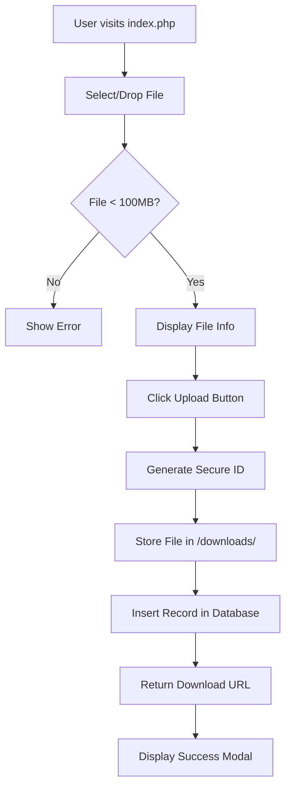
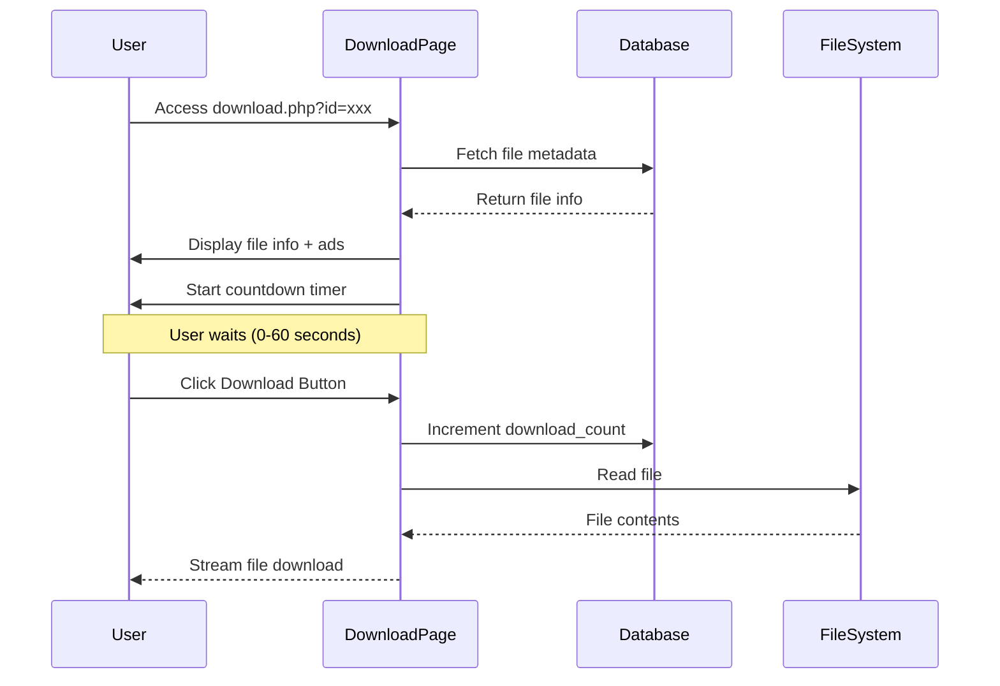
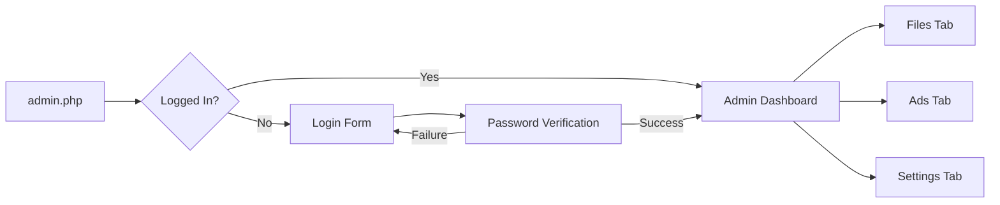
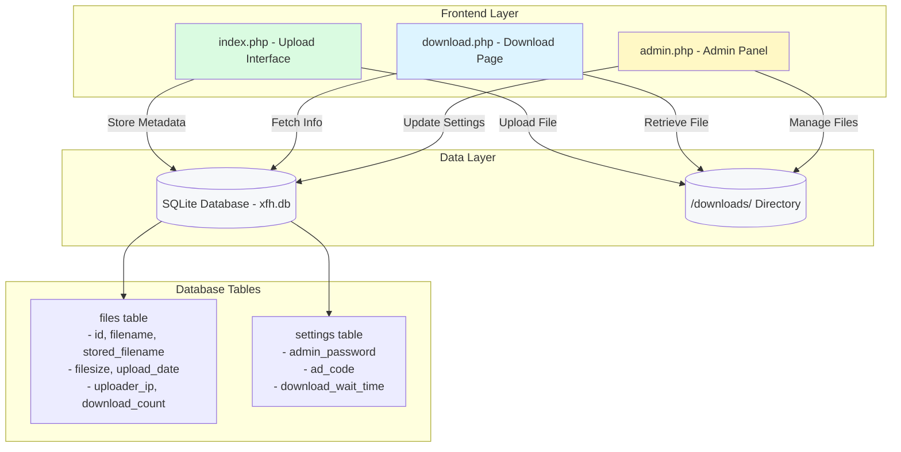

# xsukax File Hosting

A lightweight, secure, and self-hosted file sharing solution built with PHP and SQLite. Share files effortlessly with customizable download pages, advertisement integration, and comprehensive administrative controls.

## 🎯 Project Overview

xsukax File Hosting is a modern, minimalist file hosting platform designed for individuals and organizations seeking complete control over their file sharing infrastructure. Built on PHP with SQLite as its database backend, the application provides a clean, intuitive interface for uploading files, generating shareable download links, and managing hosted content through a secure administrative panel.

The platform emphasizes simplicity without sacrificing functionality, offering features such as customizable download wait times, advertisement code integration for monetization, and detailed file analytics—all while maintaining a small footprint and straightforward deployment process.

## 🔒 Security and Privacy Benefits

xsukax File Hosting implements multiple layers of security to protect both administrators and end-users:

### File Security
- **Secure Random File IDs**: Each uploaded file receives a cryptographically secure 32-character hexadecimal identifier generated using `random_bytes()`, making file URLs virtually impossible to guess or enumerate
- **Separate Storage Names**: Original filenames are never exposed in the file system; files are stored with randomized names to prevent direct access attempts
- **Input Validation**: All file IDs undergo strict regex validation (`^[a-f0-9]{32}$`) to prevent path traversal and injection attacks
- **File Size Limits**: Enforced maximum upload size (100MB default) prevents resource exhaustion attacks

### Administrative Security
- **Password Hashing**: Admin credentials are secured using bcrypt (`PASSWORD_BCRYPT`) with automatic salt generation
- **Session Management**: Secure PHP session handling with login state verification on all administrative actions
- **CSRF Protection**: AJAX-based operations include validation tokens to prevent cross-site request forgery
- **SQL Injection Prevention**: All database queries utilize prepared statements with parameterized inputs

### Privacy Features
- **IP Address Anonymization**: While uploader IPs are logged for abuse prevention, they can be easily anonymized or disabled
- **No External Dependencies**: All core functionality runs locally without third-party API calls or tracking services
- **Self-Hosted Control**: Complete data sovereignty—your files never touch external servers
- **Minimal Data Collection**: Only essential metadata (filename, size, upload date) is stored

### Technical Hardening
- **Error Suppression**: Display errors are disabled in production (`ini_set('display_errors', 0)`) to prevent information disclosure
- **Secure Headers**: Download responses include `X-Content-Type-Options: nosniff` to prevent MIME-type sniffing attacks
- **File Permission Management**: Uploaded files receive restrictive permissions (0644) automatically
- **Database Security**: SQLite database uses PDO with exception mode enabled for safe error handling

## ✨ Features and Advantages

### For End Users
- **Drag-and-Drop Interface**: Intuitive file upload with visual feedback and progress indication
- **Instant Shareable Links**: Receive direct download URLs immediately after upload
- **Responsive Design**: Fully functional on desktop, tablet, and mobile devices
- **Clean Download Pages**: Professional, ad-free (or customizable ad-enabled) download experience
- **File Information Display**: View file size, upload date, and download statistics before downloading

### For Administrators
- **Comprehensive Dashboard**: Real-time statistics showing total files, storage usage, and download counts
- **File Management**: Browse, search, and delete uploaded files with detailed metadata
- **Advertisement Integration**: Inject custom HTML/JavaScript ads with live preview functionality
- **Configurable Wait Times**: Set download delays from 0-60 seconds to increase ad exposure
- **Password Management**: Change admin credentials securely from within the panel
- **Pagination Support**: Efficient browsing of large file collections (20 files per page)
- **Server Configuration Insights**: View PHP upload limits and memory settings at a glance

### Technical Advantages
- **Zero External Dependencies**: Pure PHP implementation with no frameworks or libraries required
- **SQLite Backend**: No separate database server needed—entire application is portable
- **Single-Directory Deployment**: All files contained in one folder for easy installation and backup
- **CDN-Free Design**: Uses Tailwind CSS via CDN only for styling—core functionality remains independent
- **Minimal Resource Footprint**: Runs efficiently on shared hosting environments
- **Easy Customization**: Clean, well-commented code facilitates modifications and extensions

## 📋 Installation Instructions

### Prerequisites
- PHP 7.4 or higher (PHP 8.0+ recommended)
- SQLite3 PHP extension (typically enabled by default)
- PDO SQLite PHP extension
- Web server (Apache, Nginx, or equivalent)
- Write permissions for the application directory

### Step-by-Step Installation

1. **Clone the Repository**
   ```bash
   git clone https://github.com/xsukax/xsukax-File-Hosting.git
   cd xsukax-File-Hosting
   ```

2. **Configure File Permissions**
   ```bash
   # Create downloads directory if it doesn't exist
   mkdir -p downloads
   
   # Set appropriate permissions
   chmod 755 downloads
   chmod 644 *.php
   ```

3. **Configure PHP Settings**
   
   Edit your `php.ini` or create a `.htaccess` file (for Apache) to adjust upload limits:

   **For php.ini:**
   ```ini
   upload_max_filesize = 100M
   post_max_size = 100M
   memory_limit = 256M
   max_execution_time = 300
   max_input_time = 300
   ```

   **For .htaccess (Apache):**
   ```apache
   php_value upload_max_filesize 100M
   php_value post_max_size 100M
   php_value memory_limit 256M
   php_value max_execution_time 300
   php_value max_input_time 300
   ```

   **For Nginx:**
   
   Add to your server block:
   ```nginx
   client_max_body_size 100M;
   ```

4. **Initialize the Application**
   
   Simply access `index.php` through your web browser. The application will automatically:
   - Create the SQLite database (`xfh.db`)
   - Initialize database tables
   - Set default admin password to `admin123`

5. **Secure Your Installation**
   
   Immediately log into the admin panel at `admin.php` and change the default password:
   - Default username: (none required)
   - Default password: `admin123`
   - Navigate to Settings → Change Password

6. **Optional: Configure Web Server**

   **Apache (.htaccess):**
   ```apache
   # Prevent direct access to database
   <Files "xfh.db">
       Order allow,deny
       Deny from all
   </Files>

   # Prevent directory listing
   Options -Indexes

   # Enable clean URLs (optional)
   RewriteEngine On
   RewriteCond %{REQUEST_FILENAME} !-f
   RewriteCond %{REQUEST_FILENAME} !-d
   RewriteRule ^(.*)$ index.php [L]
   ```

   **Nginx:**
   ```nginx
   location ~ /xfh\.db$ {
       deny all;
       return 404;
   }

   location /downloads/ {
       internal;
   }
   ```

## 📖 Usage Guide

### Uploading Files

1. Navigate to the main upload page (`index.php`)
2. Either drag and drop a file onto the upload area, or click to browse your file system
3. Select a file (maximum 100MB)
4. Review the file information displayed
5. Click "Upload File" and wait for completion
6. Copy the generated download URL from the success modal



### Downloading Files

When users access a download link:

1. The download page displays file information (name, size, upload date, download count)
2. If configured, advertisements appear with automatic responsive sizing
3. A countdown timer (0-60 seconds, admin-configurable) begins
4. After the timer expires, the download button becomes active
5. Clicking the button initiates the file download and increments the download counter



### Administrative Tasks

#### Accessing the Admin Panel

1. Navigate to `admin.php`
2. Enter the admin password (default: `admin123`)
3. Access the dashboard with three main tabs:
   - **Files Management**: Browse, view, and delete uploaded files
   - **Advertisement**: Configure and preview ad code
   - **Settings**: Adjust download wait times and change password



#### Managing Files

- **View All Files**: The Files Management tab displays paginated list of all uploads
- **File Details**: Each entry shows ID, filename, size, uploader IP, upload date, and download count
- **Delete Files**: Click the "Delete" button next to any file to remove it (confirmation required)
- **View Downloads**: Click "View" to open the file's download page in a new tab
- **Refresh List**: Use the "Refresh" button to reload the file list

#### Configuring Advertisements

1. Navigate to the "Advertisement" tab
2. Enter your HTML/JavaScript ad code in the textarea
3. Click "Preview Ad" to see exactly how it will appear on download pages
4. Click "Update Advertisement" to save your changes
5. The system automatically centers and scales images responsively

**Supported Ad Formats:**
- Image banners (any size - automatically responsive)
- JavaScript ad networks (Google AdSense, etc.)
- Custom HTML/CSS content
- Iframe embeds

**Example Ad Code:**
```html
<a href="https://example.com">
  
</a>
```

#### Adjusting Settings

**Download Wait Time:**
- Set between 0-60 seconds
- 0 seconds = instant download
- Higher values increase ad exposure time

**Password Management:**
1. Enter your current password
2. Enter a new password (minimum 6 characters)
3. Confirm the new password
4. Click "Change Password"

**Server Configuration:**
The Settings tab displays current PHP limits:
- Maximum upload size
- Maximum POST size
- Memory limit
- Maximum execution time

These help diagnose upload issues and determine if php.ini adjustments are needed.

### Application Architecture



## 📄 License

This project is licensed under the GNU General Public License v3.0.

## 🤝 Contributing

Contributions are welcome! Please feel free to submit pull requests, report bugs, or suggest features through the GitHub issue tracker.

## 📞 Support

For issues, questions, or feature requests, please visit the [GitHub repository](https://github.com/xsukax/xsukax-File-Hosting) and open an issue.

## 🙏 Acknowledgments

- Built with PHP and SQLite for maximum portability
- Styled with Tailwind CSS for modern, responsive design
- Inspired by the need for simple, self-hosted file sharing solutions

---

**Made with ❤️ by xsukax**
